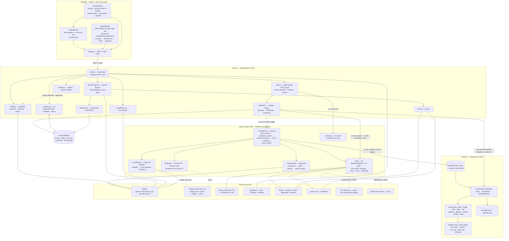
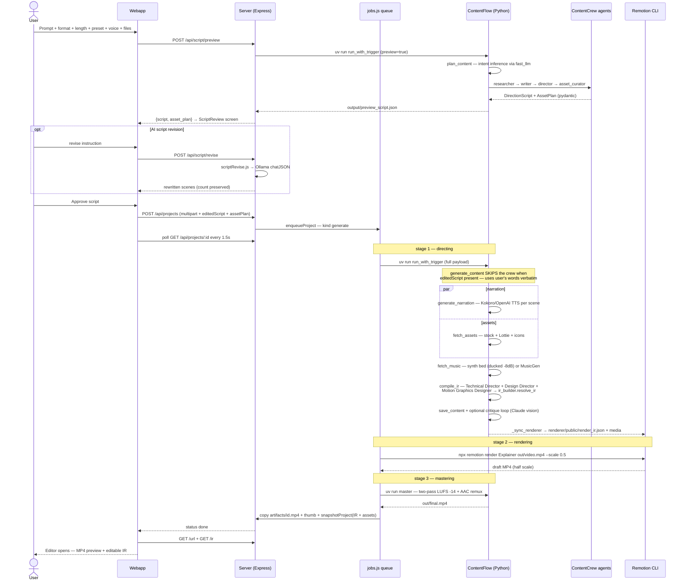
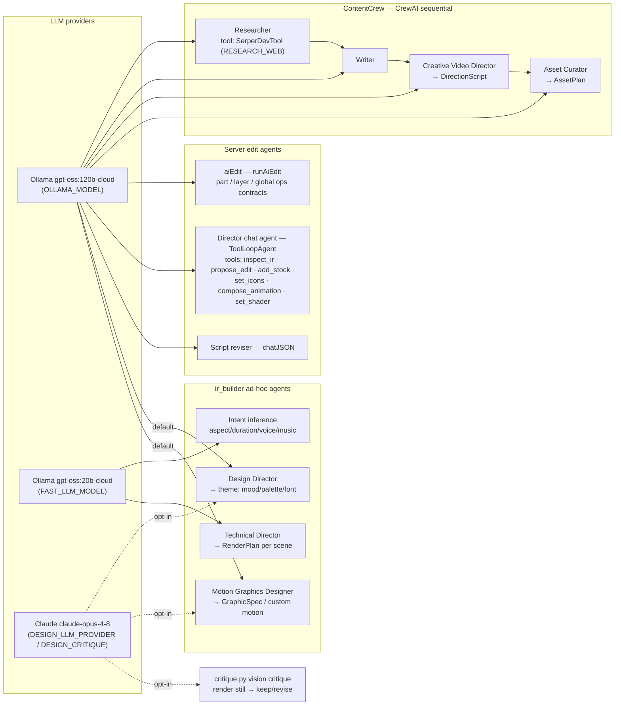
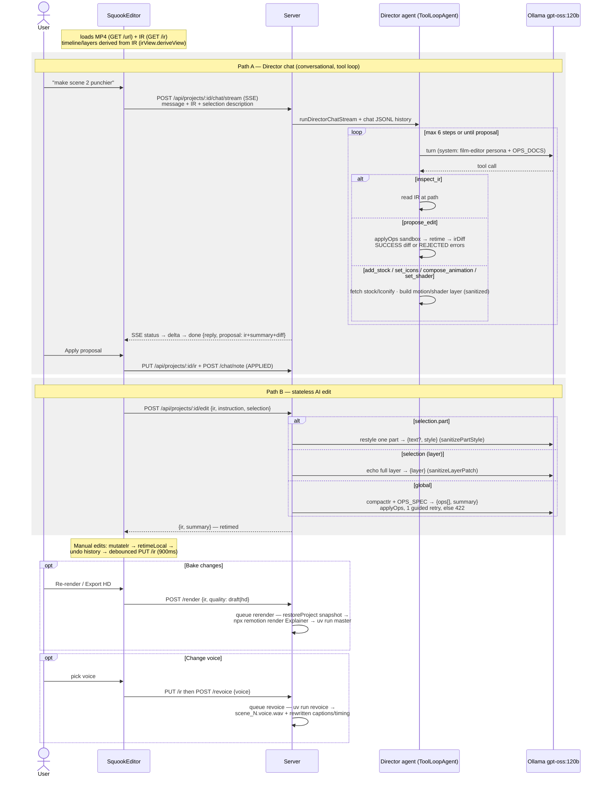

# Squook — Architecture

Four codebases: `webapp/` (React UI), `server/` (Node/Express orchestrator), `guide_creator_flow/` (Python CrewAI generation flow), `renderer/` (Remotion project). The **IR JSON** (`render_ir.json`) is the central contract: the Python flow produces it, the Remotion renderer consumes it, and the editor + edit agents mutate it.

## 1. System overview

## 2. Prompt → Video (generation pipeline)

## 3. Agents, models, and tools

## 4. Prompt → Edit (editor + Director agent)

## 5. Ops-DSL (the edit contract)

Applied by `applyOps` in `server/src/aiEdit.js` (max 20 ops, whitelisted + clamped, every path ends in `retime`):

| Op | Effect |
|---|---|
| `set_layer` | Patch editable fields of one layer (`src`/`words` untouchable) |
| `set_scene` | duration_s, narration, transition_out |
| `set_theme` | palette + font sizes |
| `set_music` | volume or remove |
| `reorder_scenes` | full permutation only |
| `remove_scene` / `remove_layer` | delete (never the last scene) |
| `add_layer` | text/solid/video/image — media must reuse existing project files |

## 6. Key env vars

| Var | Effect |
|---|---|
| `PIPELINE_MODE=real` | run the actual flow (default `mock`) |
| `OLLAMA_BASE_URL` / `OLLAMA_MODEL` / `FAST_LLM_MODEL` | LLM endpoints/models |
| `DESIGN_LLM_PROVIDER=claude` + `ANTHROPIC_API_KEY` | Claude for design agents |
| `DESIGN_CRITIQUE=true` (+ `DESIGN_CRITIQUE_MODEL`, `_MAX`) | vision critique loop |
| `OPENAI_API_KEY` | OpenAI TTS over local Kokoro |
| `MUSICGEN_OPTIN=true` + `HF_TOKEN` | MusicGen track (non-commercial weights) |
| `RESEARCH_WEB=true` + `SERPER_API_KEY` | researcher web search |
| `SUPABASE_URL` / keys | auth + persistence + storage |
| `PEXELS_API_KEY` / `PIXABAY_API_KEY` / `LOGO_DEV_TOKEN` | stock providers |
